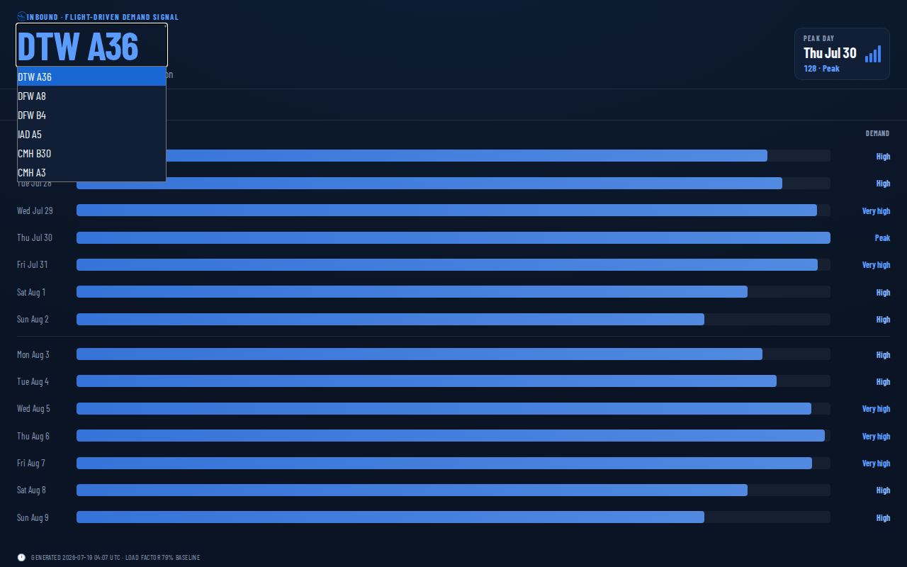
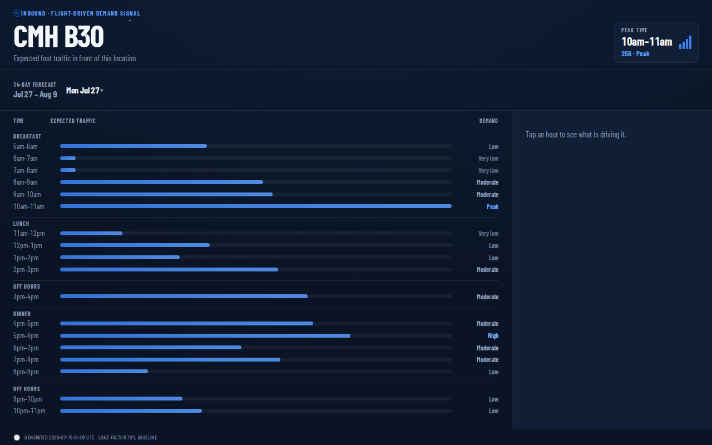
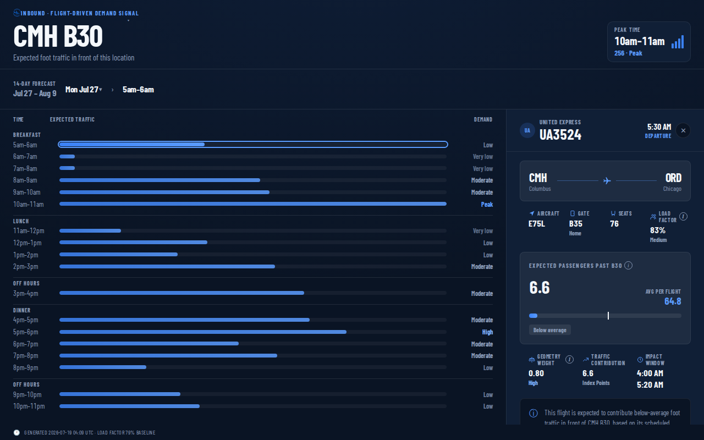
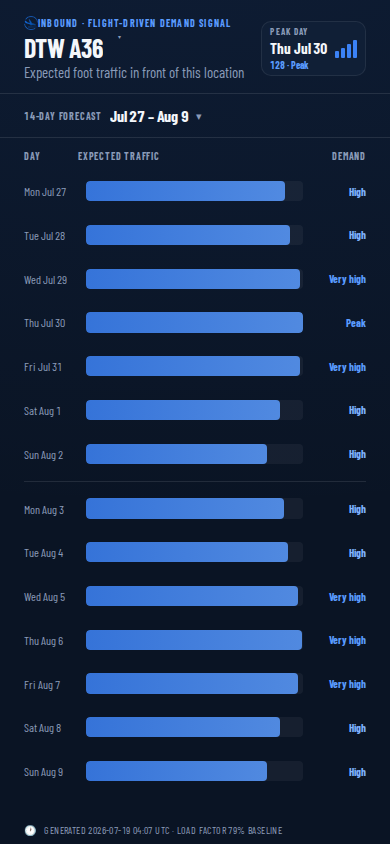

<p align="center">
  
</p>

<h1 align="center">Inbound</h1>
<p align="center">A flight schedule, turned into an hour-by-hour foot traffic forecast, for any airport store.</p>

<p align="center">
  <a href="https://inbound-dtw.netlify.app">inbound-dtw.netlify.app</a>
</p>

## What it is

Plum Market runs small stores at airport gates. Every flight through a concourse is a knowable, timestamped thing: which gate, how many seats, when it lands or leaves. Inbound turns that public flight schedule into a curve of expected foot traffic, broken down to the hour, for whichever store you pick, with every spike traceable back to the actual flights causing it.

It started as one store, Gate A36 at Detroit Metro. It's now six: two more at DFW (Terminal A and Terminal B), one at Dulles, two at Columbus. Picking a different store is just picking a different option from a dropdown, since the whole pipeline was built to treat "which airport, which gate" as a variable, not an assumption baked into the code.

There's no point-of-sale data behind any of this and no historical sales to fit against. That's on purpose. The goal isn't forecast accuracy, it's proving the mechanism: that a store's busy and quiet hours are already visible in a flight schedule, before anyone hands over sales data to calibrate it. Click any bar and you see the real aircraft, seat counts, and gates driving that hour. Nothing on screen is a black box.

<p align="center">
  
</p>

## The three-layer split

```
Aviation Edge API  →  SQL Server 2022  →  forecast-{code}.json  →  Git  →  Netlify (static site)
                       staging → model → export
```

- **SQL Server is the engine.** It ingests flight schedules, runs the demand model, and exports one small JSON artifact per store.
- **The site is just the viewer.** Switching stores in the picker is just fetching a different static file. No database connection at request time, no serverless proxy, no model logic in the browser.
- **Git is the handoff.** A nightly job refreshes every store's artifact and commits it. Netlify's build hook picks up the push and redeploys.

This isn't just a deployment convenience. A live tunnel from a public site back to a home SQL Server instance is a real outage risk for no visible upside, since a viewer can't tell "cached" from "live" by looking at a bar chart. Publishing static artifacts means the site is structurally incapable of showing a broken or empty screen, and it loads instantly, which reads as quality on its own.

## The model

All of it lives in T-SQL, in `sql/`, written to be read on its own. The shape:

**Per flight:**
```
exposure = seats(aircraftType) × loadFactor × geometryWeight(gate, store)
```

- `seats` comes from an aircraft-type lookup, not the flight record. Aviation Edge doesn't report seat counts, and the lookup now covers everything from a 5-seat charter turboprop to an A380.
- `loadFactor` is the one modeled assumption in the whole system, and it's a real one now: calibrated from a full year of BTS passenger data rather than a guess, so a slow January and a packed July actually read differently instead of both defaulting to the same flat number.
- `geometryWeight` is the part a generic dashboard wouldn't build: the probability a passenger from that gate actually walks past this particular store, based on where the gate sits relative to security, the tram or train stops, and the store itself. Every store gets its own weights, researched from that airport's real layout, not copy-pasted from another one.

**The honest-uncertainty part:** a lot of flights this far out don't have a gate assigned yet. Rather than guess one flat number for "unknown," each airline's own already-resolved flights teach the model what's likely: an American Airlines flight with no gate yet at a hub where AA flies from four different terminals gets a properly hedged weight, not the same number a foreign carrier that's never once used that terminal would get. The drill-down reflects this honestly too. Only flights with a real, resolved gate are listed individually; the rest collapse into a single "+N flights, gate not yet assigned" line instead of padding out the list with guesses dressed up as facts.

**Per flight, per hour:** a discrete flight becomes a distributed signal by spreading its exposure across the hours passengers are actually in motion, using a triangular dwell curve (departures build to a peak around 50 minutes before wheels-up, arrivals front-load right after landing). That spreading is done set-based, a tally table cross joined against every flight, normalized so each flight's weights sum to 1 across its own window. No cursors, no per-row loops.

**Aggregation:** hourly exposure rolls up to an index, `100 = an average hour`, so the headline number is always relative and never an unverifiable raw passenger count. That average is a real one too: calibrated from a full year of that airport's own BTS traffic, not a 14-day snapshot, so a genuinely busy week reads as busy and a quiet one reads as quiet, the same way every time you check.

Every model constant (load factor, gate zone weights, dwell curve timing, daypart windows) lives in a config table, not a literal in a view. Retuning the model is an `UPDATE` statement, not a redeploy.

## The interface

Two views, phone-first, no charting library. Bars are hand-rolled SVG and CSS because a charting library's defaults would fight the type system and spacing this design depends on.

- **14-day range view**, the landing view. Its width isn't an arbitrary "two weeks," it's two of Plum's actual reorder cycles, so a spike just past the visible edge never ambushes a buyer mid-order. Tap the date range to page to the next window; the number of windows is a config value, not a hardcoded limit.
- **18-hour day view**, one tap into any day. Fits the store's actual open hours on one screen, no scrolling, ever, since bar height is computed from available space rather than a fixed pixel value.
- **Tap an hour, then tap a flight** to reach the raw math behind it: aircraft type, seats, load factor, gate, and the estimated share of passengers walking past this store. This drill-down is the credibility mechanism. The forecast is only convincing if anyone can check its work.
- **Tap the store name** at the top to switch to a different one. Same interaction as picking a day or a window, just for "which airport" instead of "which date."

<table>
<tr>
<td width="50%"></td>
<td width="50%"></td>
</tr>
<tr>
<td>Day view: daypart is a hairline and a label, never a bar color.</td>
<td>Depth 3: the raw math behind one flight, not just a bar.</td>
</tr>
</table>

<p align="center">
  
</p>
<p align="center"><em>Same layout at every breakpoint, since this doubles as the mobile reporting view.</em></p>

## Stack

- **SQL Server 2022** for ingest, modeling, and export. Four schemas: `stg` (untouched raw ingest, tagged by airport), `cfg` (every tunable constant, including a `Location` table so a new store is a config row, not a code change), `mdl` (the exposure model, views only), `export` (the procedures that shape the JSON, one call per store).
- **Vite + TypeScript**, no framework, no charting library. A dark, condensed-type dashboard styled after wayfinding signage, self-hosted fonts, native View Transitions for the day-to-hour morph.
- **Aviation Edge** for live flight schedules at every airport, refreshed nightly via cron and committed straight to the repo. **BTS** for the real annual passenger volume each store's baseline is calibrated against.
- **Netlify**, deployed from Git. No serverless functions, no environment secrets in the browser.

## Repo layout

```
sql/                        schema, config seed, model views, export and ingest-parse procedures
scripts/                    nightly ingest + export + commit pipeline (bash + sqlcmd)
src/                        the front end (TypeScript, hand-rolled SVG/CSS charts)
public/data/forecast-{code}.json   one committed artifact per store, always kept fresh or stale, never blank
public/data/locations.json  the small manifest the store picker reads
docs/BRIEF.md               the full project brief this was built against
docs/screenshots/           the images above
```

## Running it

```
npm install
npm run dev
```

The dev server reads the committed `public/data/forecast-*.json` files, so the site works with no database connection at all. Regenerating them from a live SQL Server instance is a separate step, one export per store:

```
SQLCMDPASSWORD='...' ./scripts/export_forecast.sh
```

See the header comments in `scripts/` for the full env var list and the nightly refresh flow.
